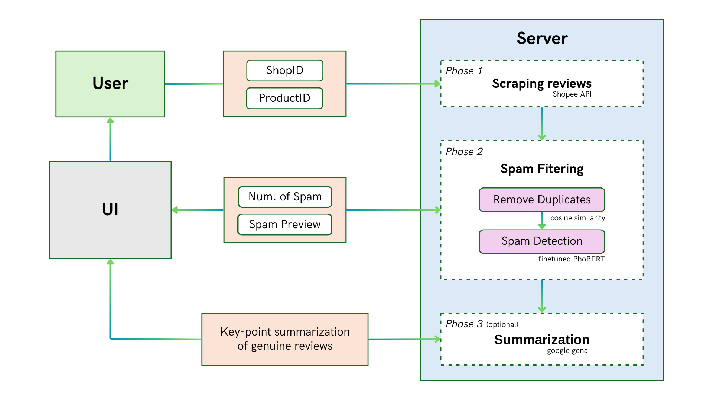

<p align="center">
    
</p>

# Shopee Browser Extension for Filtering Spam and Summarizing Product Reviews

This repository contains a project for scraping reviews from Shopee, filtering spam reviews, and summarizing genuine reviews. The project includes a web extension, a FastAPI server, and scripts for data processing and analysis.

<p align="center">
    
</p>

## Project Structure


### Python Scripts for Scraping Reviews
```
shopee_scrape/
    get_review.py
    data_info.ipynb
    all_reviews.csv
    reviews_with_comment.csv
```
### Preprocessing Reviews Modules
```
preprocessing/
    remove_duplicates.py
    deemojify.py
    remove_stopwords.py
    vietnamese-stopwords-dash.txt   # stopwords list, from https://github.com/stopwords/vietnamese-stopwords
```

### Model

model/
    /PhoBERT_finetuned  # weights of finetuned PhoBERT on 19000 Vietnamese reviews
    spam_filtering.py
    summarization.py

### Web Extension

```
extension/
    background.js
    config.js
    manifest.json
    package.json
    popup/  # optional if you want to add a popup
    src/
        content.js
        content.css
```

### FastAPI Server

server/
    fastapi_server.py

### Test Files
`*.ipynb` files in `/test` folder to ensure everything works correctly.

## Installation

### Prerequisites

- Python 3.8+
- Node.js and npm
- FastAPI
- PyTorch
- Transformers

### Setup

1. Clone the repository:

```sh
git clone https://github.com/vabpf/shopwise.git
cd shopwise
```


2. Install Python dependencies:


```sh
pip install -r requirements.txt
```


3. Install Node.js dependencies:


```sh
cd extension
npm install
```


## Usage

### Web Extension

1. Build the web extension:


```sh
npm run build
```


2. Load the extension in your browser:
   - Open Chrome and go to `chrome://extensions/`
   - Enable "Developer mode"
   - Click "Load unpacked" and select the `web_extension/extension` directory

### FastAPI Server

1. Start the FastAPI server:


```sh
cd server
uvicorn fastapi_server:app --reload
```


2. The server will be running at `http://127.0.0.1:8000`

### Scraping Reviews

1. Use the `ShopeeReviewScraper` class in `shopee_scrape/get_review.py` to scrape reviews:


```py3
from get_review import ShopeeReviewScraper

shopid = 119017165
itemid = 9060816021
scraper = ShopeeReviewScraper(itemid, shopid)
all_reviews = scraper.get_reviews()
```


### Spam Filtering and Summarization

1. Use the `spam_filtering` function in `web_extension/server/model/spam_filtering.py` to filter spam reviews:


```py3
from model.spam_filtering import spam_filtering

result = spam_filtering(reviews)
```


2. Use the `summarize` function in `web_extension/server/model/summarization.py` to summarize genuine reviews:


```py3
from model.summarization import summarize

summary = summarize(genuine_reviews)
```


## Contributing

Contributions are welcome! Please open an issue or submit a pull request.

## License

This project is licensed under the MIT License.


